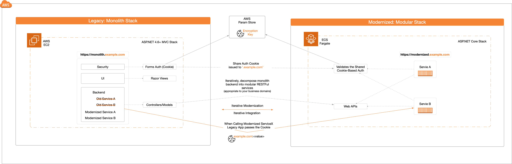

## Summary

These sample project will demonstrate the usage of a <em>Shared Auth Cookie</em> approach for seamless authentication across a monolith and its modernized version (e.g. monolith.example.com <--> modernized.example.com). 

This code repository will provide 1/ The steps to configure a shared cookie-based authentication, 2/ Sample projects demonstrating the shared auth cookie usage; semless auth between the legacy monolith ASP.NET and its modernized ASP.NET Core version, and 3/ An approach to store the cookie encryption/decryption key that's accessible by legacy monolith and its modernized version.

The diagram below shows a very high-level overview of iterative modernization and usage of the shared Auth cookie.



## Background
<details>
    <summary>Click to expand</summary>

Modernizing a legacy monolith application is an iterative process and requires the monolith and the on-going modernized versions to co-exist.  Moreover, for our use case, the legacy application uses the Forms Auth Cookie-based approach to secure its workloads. Now, to support the iterative modernization process, we need an Auth approach that works seamlessly across the monolith and its modernized version.

To accomplish the seamless Auth, we will use the <em>Shared Cookie Auth</em> approach.  The legacy monolith application will continue to validate user credentials and issue the Auth cookie, while the modernized versions will simply validate the Auth cookie.

The <em>Shared Cookie Auth</em> approach will enable us to 1/ iteratively decompose the monolith backend service into containerized (Linux) microservices, 2/ iteratively integrate the modernized backend microservices into our existing monolith UI, and 3/ ensure the the forms authentication cookie-based approach continues to work seamlessly.
</details>

## Helpful References
<details>
<summary>Click to expand</summary>

> Concepts overview: auth Scheme, auth handlers, authenticate, challenge, forbid etc. <br/>
https://docs.microsoft.com/en-us/aspnet/core/security/authentication/?view=aspnetcore-5.0

> Configuring Shared auth cookie: <br/>
https://docs.microsoft.com/en-us/aspnet/core/security/cookie-sharing?view=aspnetcore-5.0

> Data protection key storage: <br/>
https://docs.microsoft.com/en-us/aspnet/core/security/data-protection/implementation/key-storage-providers?view=aspnetcore-5.0&tabs=visual-studio

</details>

## FAQs
<details open>
<summary>Click to expand</summary>

1. What are the specific steps to configure the Shared cookie-based Auth?

    If you want to jump straight to the process to configure Shared Auth cookie approach, then reference the <em>README.SharedCookieAuthSetup.md</em> for details.

2. What is in this repository? 

    Tells the story of iteratively modernizing the legacy workloads and how the Shared Cookie approach works seamlessly across legacy and modernized versions.

    It contains the following projects:
    - ```Legacy.Monolith```: A monolith ASP.NET 4.6.1 application that provides a UI to call its services (service-A and service-B).  These services require authentication.  While modernizing, the cookie-based implementation will be updated to issue and validate a <em>Shared</em> cookie.
    - ```Modernized.Backend.ServiceA```, ```Modernized.Backend.ServiceB```: The monolith backend is decomposed into business domain specific microservices: each microservice is a ASP.NET Core WebApi project that is independently maintainable, testable, and deployable.  Also, each microservice will validate the incoming <em>Shared</em> cookie independently.     
    
        > Except the health-check endpoint, the modernized service endpoints require a valid Auth cookie.  Otherwise, it will give HTTP 401.
    
    - ```Modernized.Infrastructure```:  Stack that deploys the modernized resources.
    - ```Modernized.ApiGateway.LambdaAuthorizer```:  Shows how to centralize the Auth cookie validation logic instead of having it be a part of every individual modernized microservice.

3. Where do i start?

    In the ```Modernized.Infrastructure```, reference the Readme.md file.  It will walk-through the process to deploy and configure the Legacy monolith and the modernized workloads.

4. Can I run the example project locally?

    Yes.  You can configure the Solution to start ```Legacy.Monolith```, ```Modernized.Backend.ServiceA```, and ```Modernized.Backend.ServiceB``` and just F5 normally.

    > By default, the Cookie encryption key is stored in the AWS Param store.  To make it work against local storage reference the ````Does this example project work without the AWS Parameter Store``` section below.

5. Why the shared auth cookie and why not JWT?

    Technically, we could use JSON Web Token (JWT) for the shared authentication.  However, our fictitious business use case calls for continuous usage of the existing authentication model; cookie based forms auth.

6. Why the AWS Parameter Store

   Technically, the <em>Data Protection</em> can be stored in central repositories like the Redis cache, Network storage, and more. Our fictitious business use case requires an option that works with both the legacy application (Windows based system) and the modernized (Linux containers). For our example, we chose the AWS Parameter store.

7. Why use hardcoded credentials?

    For the ease of demo, the user credentials are hardcoded (available on the Legacy Monolith login page).  In a real-world use case, the user data store would be represented by an Identity database, Active Directory etc.

8. Why not centralize the authentication?

    The ```Modernized.ApiGateway.LambdaAuthorizer``` helps with this.  

    > This is not required and one could continue to house the cookie validation logic within each microservice (not ideal).
    
9. Does this example project work without the AWS Parameter Store?

    Yes, this example project can work against the local storage like <em>c:\drive</em>. <br/>
    Within the <em>Startup.Auth.cs</em> and the <em>Startup.cs</em> files, you can comment out the <em>CustomPersistKeysToAWSParameterStore</em> registration.

</details>
